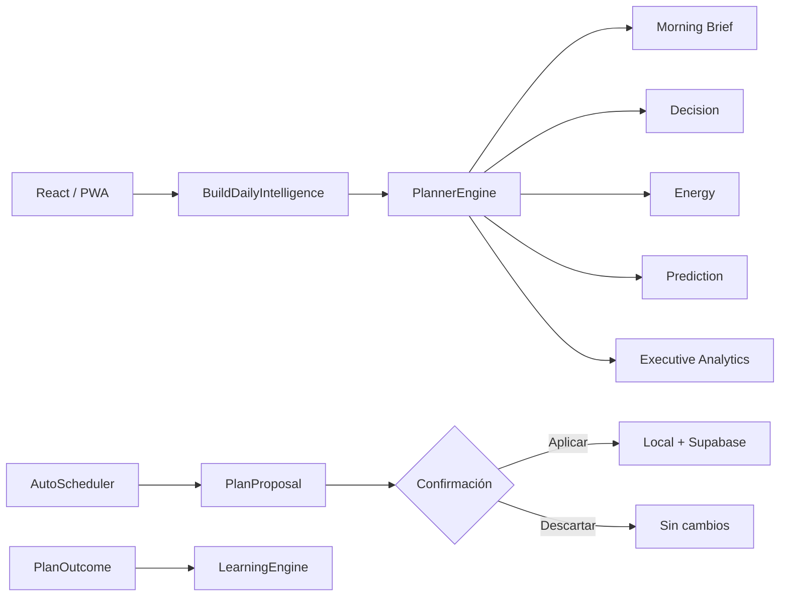
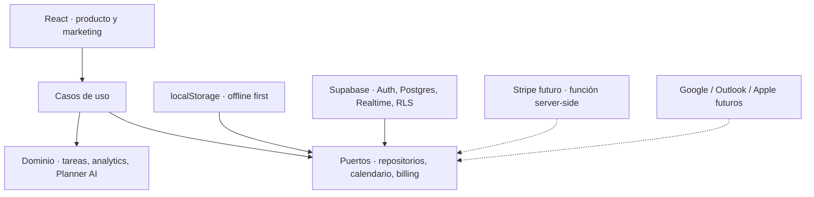

# Arquitectura de GM Daily Planner

## GM AI OS

`src/core/ai` aplica Clean Architecture: dominio y motores puros en el centro; proveedores, repositorios, eventos, casos de uso y UI como adaptadores.

## Capas

- `src/domain`: modelos y funciones puras sin React ni red.
- `src/core/ai`: GM AI OS modular, inyectable y event-driven.
- `src/planner`: Clean Architecture para planificación determinística.
- `src/data`: repositorio offline y reconciliación por fecha de actualización.
- `src/services`: orquestación de sincronización.
- `src/components`: presentación y acciones del usuario.
- `src/billing`: catálogo y contratos comerciales; no contiene secretos ni llamadas de cobro.
- `src/marketing`: páginas públicas, metadata dinámica y adquisición.
- `supabase/migrations`: esquema, triggers, índices, Realtime y políticas RLS.

## Principios de datos

1. La escritura local ocurre primero.
2. Una respuesta remota antigua nunca elimina cambios locales recientes.
3. Toda fila sincronizada contiene `user_id`.
4. RLS verifica `auth.uid()` para lectura y escritura.
5. La service role solo puede existir en backend o tareas operativas seguras.

## Extensibilidad

`PlanningStrategy`, `CalendarAdapter`, `LearningRepository` y `BillingGateway` son límites explícitos. OpenAI, Stripe o calendarios externos deben implementarse detrás de estos contratos; los componentes no deben llamar SDK externos directamente.
