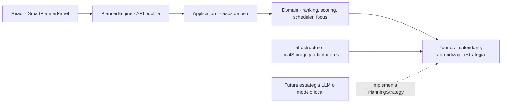

# Planner AI Engine

Planner AI Engine es el núcleo determinístico de planificación de GM Daily Planner. Analiza tareas, calendario, disponibilidad, energía, prioridades, dependencias, hábitos, objetivos e historial sin depender de servicios de inteligencia artificial.

## Arquitectura

El módulo sigue Clean Architecture y separa las reglas de negocio de React, Supabase y el almacenamiento:



- `domain/entities`: `PlannerTask`, perfil, planes y eventos de aprendizaje.
- `domain/valueObjects`: operaciones puras de tiempo e intervalos.
- `domain/rules`: pesos y umbrales configurables; las reglas no contienen números mágicos.
- `domain/services`: energía, scoring, foco y división de tareas.
- `domain/ranking` y `domain/scheduler`: orden estable y construcción diaria/semanal sin solapamientos.
- `domain/learning`: patrones locales preparados para entrenamiento futuro.
- `application`: comandos, consultas y casos de uso.
- `infrastructure`: compatibilidad con tareas actuales, almacenamiento local y contratos de calendario.
- `plannerEngine.ts`: fachada única consumida por la aplicación.

El contrato genérico `PlanningStrategy<Input, Output>` permite sustituir o complementar el scheduler por OpenAI, Anthropic o un modelo local sin cambiar la UI ni las entidades. La estrategia actual continúa siendo local, explicable y offline-first.

## API pública

```ts
import { planner } from '../planner'

planner.planDay(command)
planner.planWeek(command)
planner.recalculate(command)
planner.rankTasks(query)
planner.optimize(plan)
planner.splitTask(task)
planner.buildFocusBlocks({ date, events, profile })
planner.learn(events)
```

El motor no escribe tareas ni agendas. Devuelve propuestas inmutables y la capa de aplicación decide cuándo persistirlas. Así se conserva el requisito de confirmación antes de modificar la agenda y se mantiene intacta la sincronización existente con Supabase.

## Reglas principales

1. Excluye tareas completadas y bloquea tareas con dependencias pendientes.
2. Puntúa urgencia, importancia, deadline, energía, dependencias, historial, contexto, duración, prioridad manual, objetivos y hábitos con pesos configurables.
3. Protege eventos existentes, almuerzo y bloques bloqueados.
4. Selecciona huecos compatibles con energía y periodo preferido.
5. Penaliza cambios de contexto y fragmentos residuales demasiado pequeños.
6. No supera la disponibilidad, no solapa bloques y devuelve todo lo no programado.
7. Divide tareas de más de 90 minutos en fases trazables sin marcarlas como contenido generado por IA.
8. El recálculo preserva el pasado y los bloques bloqueados; solo reorganiza el futuro.

## Privacidad y aprendizaje

Los eventos de aprendizaje se almacenan en `localStorage` bajo claves versionadas. Solo se registran métricas de ejecución suministradas por la aplicación; el motor no envía datos a terceros. Si el almacenamiento no está disponible, usa memoria y la planificación continúa funcionando.

Los adaptadores Google Calendar, Outlook y Apple Calendar son contratos reales que fallan con un mensaje explícito hasta que exista autorización OAuth. No devuelven datos simulados.

## Calidad y rendimiento

```bash
pnpm typecheck
pnpm lint
pnpm test
pnpm test:planner:coverage
pnpm build
```

La suite incluye ranking, scoring, energía, scheduler, recálculo, foco, subtareas, aprendizaje, compatibilidad heredada, adaptadores, almacenamiento y casos límite. El benchmark automatizado construye un día con 500 tareas y exige menos de 150 ms. Como el cálculo medido permanece por debajo del presupuesto, no se añadió un Web Worker ni peso adicional al bundle; el límite está protegido por una prueba de regresión.

## Evolución

- Implementar una `PlanningStrategy` remota detrás de consentimiento y feature flag.
- Persistir el perfil y aprendizaje cifrado por usuario mediante un repositorio Supabase.
- Conectar calendarios con OAuth en backend y scopes mínimos de lectura.
- Ejecutar el motor en Web Worker si los benchmarks reales de dispositivos móviles superan el presupuesto.
- Versionar reglas y registrar experimentos para comparar planes sin perder explicabilidad.
