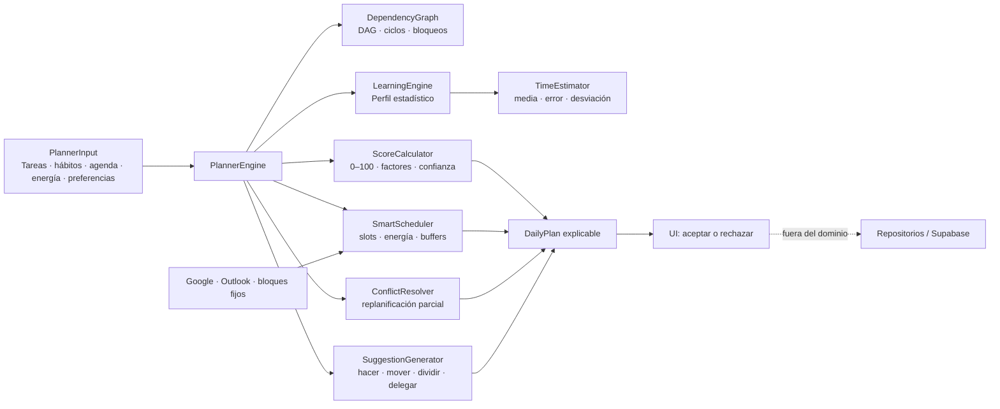

# GM Planner Intelligence Engine V3

## Propósito

V3 es un dominio determinista y sin efectos secundarios. Recibe una fotografía del día y devuelve un `DailyPlan` explicable. No escribe en Supabase, `localStorage`, React ni repositorios. La interfaz conserva la decisión de aceptar o rechazar la propuesta.

## Arquitectura



## Módulos

- `PlannerTypes.ts`: contratos versionados y valores predeterminados.
- `ScoreCalculator.ts`: score ponderado entre 0 y 100 con doce factores configurables.
- `EnergyModel.ts`: cinco niveles y regla dura que impide asignar trabajo complejo con energía insuficiente.
- `TimeEstimator.ts`: predicción corregida por duración real, error medio y desviación estándar.
- `DependencyGraph.ts`: DAG, orden topológico, faltantes, bloqueos y ciclos.
- `SmartScheduler.ts`: asignación sin solapamientos sobre huecos reales.
- `ConflictResolver.ts`: identifica el subconjunto afectado por un evento nuevo.
- `LearningEngine.ts`: perfil estadístico inmutable basado en observaciones.
- `SuggestionGenerator.ts`: recomendaciones deterministas y explicables.
- `PlannerEngine.ts`: fachada/orquestador.

## Invariantes

1. La entrada nunca se modifica.
2. No hay IO ni acceso a estado global.
3. Una tarea completada nunca se programa.
4. Un ciclo o dependencia inexistente produce conflicto auditable.
5. Una tarea no se asigna por debajo de su energía mínima.
6. Los bloques externos, fijos, almuerzo y buffers ocupan capacidad.
7. No existen solapamientos entre tareas propuestas.
8. Cada tarea propuesta contiene score, confianza, factores y explicación.
9. Una reunión nueva solo recalcula tareas que se solapan con ella.

## Scoring

Los pesos predeterminados suman 100 y pueden sobrescribirse parcialmente:

| Factor | Peso |
|---|---:|
| Urgencia | 13 |
| Fecha límite | 14 |
| Importancia | 13 |
| Ajuste temporal | 8 |
| Energía | 11 |
| Dependencias | 10 |
| Contexto | 6 |
| Frecuencia | 4 |
| Historial | 6 |
| Reprogramaciones | 5 |
| Complejidad | 4 |
| Tiempo restante | 6 |

Los pesos se normalizan en ejecución. Un conjunto de pesos inválido o con suma cero no produce división por cero.

## Compatibilidad

Los campos son opcionales salvo `id` y `title`. Esto permite construir adaptadores desde `Task` y `PlannerTask` existentes sin migrar datos. Las integraciones de calendario entran como `BusyBlock`; el dominio no conoce SDKs ni credenciales.

## Rendimiento

Comando:

```bash
pnpm exec vitest run src/domain/planner-engine/PlannerBenchmark.test.ts --reporter=verbose
```

El benchmark realiza calentamiento y reporta la mediana de cinco ejecuciones. Presupuestos:

- 1.000 tareas: menos de 100 ms.
- 500 eventos: menos de 50 ms.

Los números dependen del equipo y deben vigilarse en CI sobre hardware estable.

## Integración futura

La UI debe llamar `createPlan`, presentar el resultado y persistir únicamente tras confirmación explícita. Un adaptador de aplicación deberá convertir modelos heredados y resolver zonas horarias a ISO antes de entrar al dominio.

## Riesgos

- El scheduler actual es greedy determinista; no garantiza óptimo matemático global.
- Los timestamps ISO requieren que el adaptador defina correctamente la zona horaria.
- Las tareas dependientes pueden planificarse después de su predecesora, pero su score conserva penalización hasta disponer de historial de finalización.
- Los tiempos de traslado variables requieren un proveedor externo, fuera del dominio.
- El modelo estadístico necesita muestras suficientes para elevar su confianza.
- La replanificación parcial debe revalidarse si una cadena completa de dependencias resulta afectada.

## Roadmap V3.1

1. Adaptadores explícitos para `Task`, `PlannerTask` y eventos recurrentes expandidos.
2. Propagación transitiva de tareas afectadas en replanificación parcial.
3. Búsqueda con backtracking acotado para mejorar la optimalidad.
4. Restricciones por localización y traslado dinámico.
5. Persistencia versionada de métricas mediante un puerto de aplicación.
6. Benchmarks comparativos en CI y detección automática de regresiones.
7. Simulador visual de planes alternativos, siempre sujeto a confirmación.
