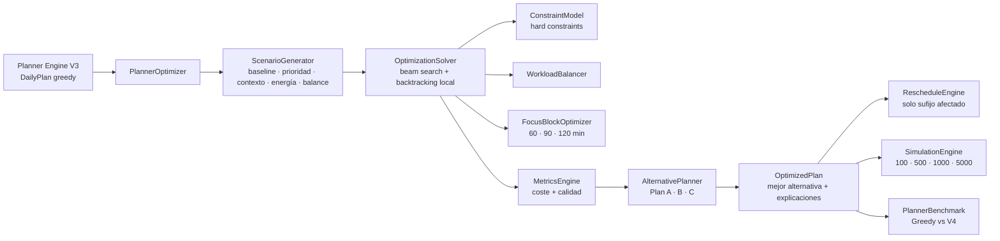

# GM Planner Optimization Engine V4

## Propósito

V4 optimiza el `DailyPlan` producido por Planner Engine V3. Es una capa determinista, pura y sin integración con React, Supabase, proveedores de calendario o modelos generativos. V3 permanece intacto.

La interfaz podrá presentar `OptimizedPlan`, sus alternativas y explicaciones, pero seguirá siendo responsable de solicitar confirmación antes de persistir.

## Arquitectura



## Estrategia híbrida

1. Conserva el baseline de V3.
2. Genera escenarios deterministas por prioridad, contexto, energía y carga.
3. Genera vecinos mediante swaps acotados —backtracking local— para escapar de mínimos locales.
4. Reubica tareas dentro del horizonte original.
5. Rechaza primero alternativas con restricciones críticas.
6. Evalúa las alternativas seguras mediante una función de coste ponderada.
7. Devuelve las tres mejores y selecciona automáticamente la primera.

El algoritmo es una búsqueda de haz acotada con vecindad determinista. Evita el coste factorial de explorar todas las permutaciones.

## Función de coste

Todos los pesos son configurables:

- Cambios de contexto.
- Fragmentación.
- Fatiga.
- Bloques pequeños.
- Tiempo muerto.
- Interrupciones.
- Solapamientos.
- Deep work.
- Flujo continuo.
- Prioridad completada.
- Alineación energética.
- Probabilidad de completar el día.
- Satisfacción.
- Urgencia.
- Dependencias.
- Retrasos.
- Rachas.

La puntuación final está normalizada entre 0 y 100. `cost = 100 - score`.

## Restricciones duras

- No solapar tareas.
- No invertir dependencias.
- No mover tareas protegidas.
- No aceptar duraciones negativas o nulas.
- No exceder el horizonte del plan original.

Si todas las nuevas alternativas violan una restricción crítica, el baseline conserva prioridad.

## Focus blocks

`FocusBlockOptimizer` detecta secuencias contiguas de energía alta o muy alta y crea bloques protegidos de 60, 90 o 120 minutos. Los bloques nunca se dividen dentro de una alternativa.

## Replanificación parcial

`RescheduleEngine` calcula el primer índice afectado por:

- Una reunión nueva.
- Una tarea que tarda más.
- Una cancelación.

Las tareas anteriores permanecen byte a byte en su posición. Solo se optimiza el sufijo afectado.

## Explicabilidad

Cada tarea devuelve:

- Por qué se conservó o movió.
- Posición anterior y nueva.
- Qué métricas mejoraron.
- Qué empeoró.
- Score anterior.
- Score nuevo.

## Benchmarks

Metodología: calentamiento y mediana de cinco ejecuciones, sin instrumentación de cobertura.

```bash
pnpm test:planner-v4:benchmark
```

Presupuestos obligatorios:

- 1.000 tareas: menos de 150 ms.
- Pipeline V3→V4 con 500 eventos: menos de 80 ms.

La simulación adicional mide 100, 500, 1.000 y 5.000 tareas, incluyendo latencia, tamaño serializado aproximado, score y ganancia. Los resultados dependen del hardware y deben capturarse en CI sobre una máquina estable.

## Límites y riesgos

- V4 recibe `DailyPlan`; no puede distinguir si un hueco representa tiempo libre o un evento externo que V3 no haya conservado como metadato.
- La replanificación parcial actual opera sobre un sufijo; V5 deberá calcular el cierre transitivo de dependencias afectadas.
- La búsqueda acotada mejora calidad sin explosión combinatoria, pero no prueba optimalidad matemática global.
- Los planes de 5.000 tareas exceden el caso diario real y muestran crecimiento de memoria por conservar tres alternativas completas.
- La satisfacción y probabilidad son indicadores deterministas, no predicciones clínicas ni generativas.
- Los timestamps sin offset se tratan como tiempo mural. El adaptador de aplicación debe mantener una zona horaria explícita.

## Roadmap V5

1. Modelo de intervalos que preserve explícitamente reuniones y ventanas libres.
2. Propagación transitiva de dependencias en replanificación parcial.
3. Large Neighborhood Search con presupuesto temporal.
4. Branch-and-bound para subconjuntos críticos.
5. Pareto frontier entre estabilidad, productividad y bienestar.
6. Compactación estructural de alternativas para reducir memoria.
7. Perfiles estadísticos versionados por zona horaria y contexto.
8. Benchmarks CI con regresión automática de latencia, memoria y calidad.
9. Adaptador de aplicación para aceptación/rechazo, sin persistencia automática.
